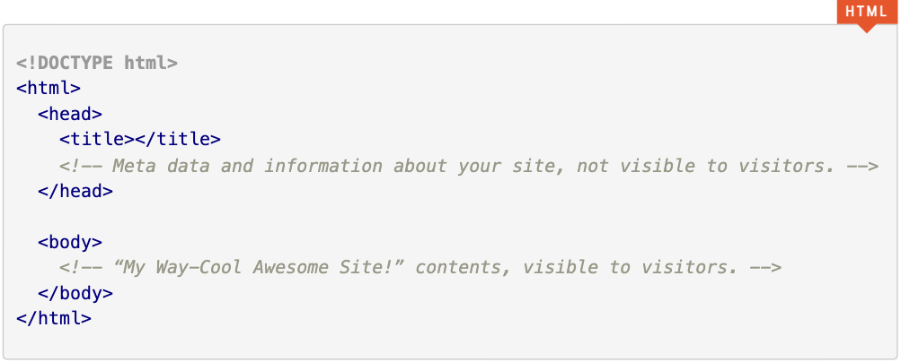
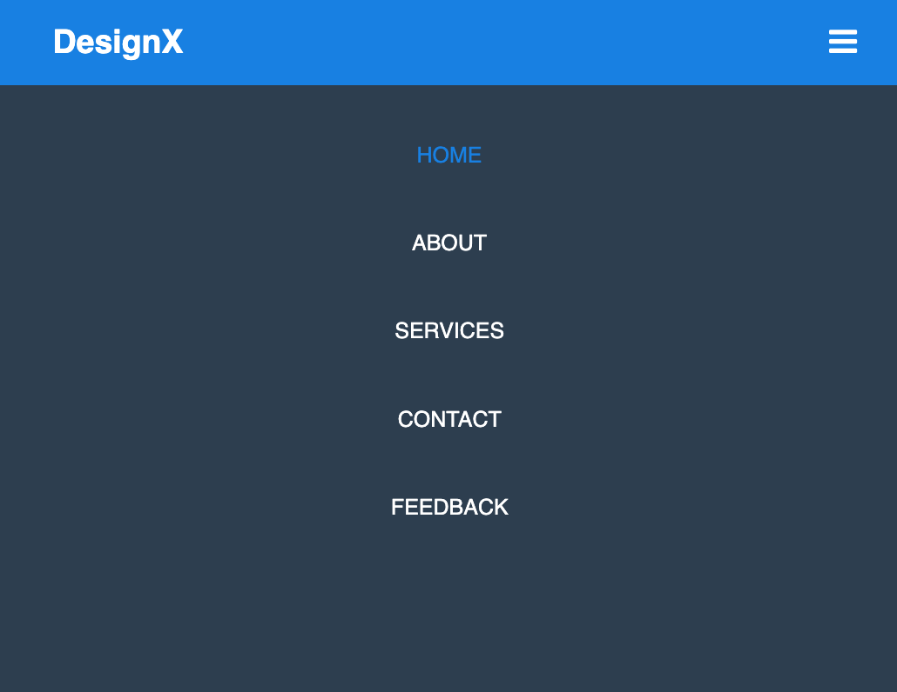

# Responsive navigation bar (Part 1 - without media queries)

In this follow-me exercise you will learn how to create a responsive navigation bar with HTML and CSS.

## Installation

Download/clone this repo to your machine (Mac / Win).
Next open the **index.html** file from the repository that you downloaded above with your editor Visual Studio Code. 

## The 4 Main Document Elements

- The <!DOCTYPE> declaration.
- The <root> element.
- The <head> element.
- The <body> element.


This is the basic layout of an HTML document.



## HTML

Remember that when you build a website you must always start with 
```html
<!DOCTYPE html> on the first line (index.html).
```
Here are some of the HTML-tags that we will be using in the head section of the html document.
```html
<html>  </html>
<head>  </head>  
<meta /> 
<title> </title> 
<link />
```

Here are some of the HTML-tags that we will be using in the body section of the html document. All HTML-tags in the body section are visibly for the human eye.

```html
<body> </body>
<nav> </nav>
<input type="checkbox"/>
<label> </label>
<ul> </ul>
<li> </li>
<a href=""> </a>
<section> </section>
<h1> </h1>
```

## CSS

Here are some of the CSS properties that we will be using to style our responsive navigation bar and website.

```css
padding
margin
text-decoration
list-style
box-sizing
font-family
background-color
height
width
color
font-size
line-height
font-weight
float
margin-right
display
text-transform
transition
border-radius
cursor
display
```


## Final Result




